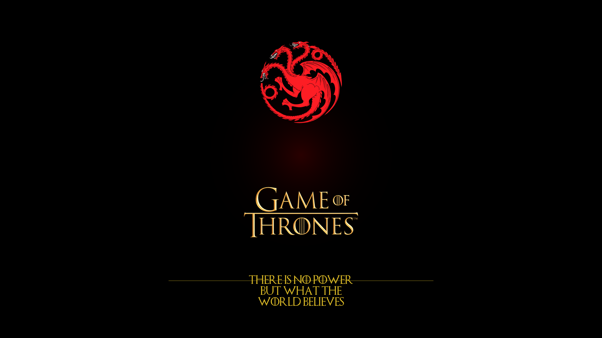

# Game Of Thrones Dark

A dark desktop theme for **Omarchy** with Targaryen red and weathered gold accents, inspired by the Iron Throne and the world of Game of Thrones.



## Color Palette

| Role        | Hex       | Description             |
|-------------|-----------|-------------------------|
| Background  | `#000000` | Pure black              |
| Accent      | `#CC0000` | Targaryen crimson red   |
| Foreground  | `#FFD700` | Weathered gold          |
| Cursor      | `#FFD700` | Gold cursor             |
| Selection   | `#CC0000` | Red selection highlight |

## What's Included

- **`colors.toml`** — Terminal color scheme (Alacritty, Kitty, Foot, Ghostty)
- **`btop.theme`** — Btop system monitor theme
- **`vscode.json`** — VS Code extension recommendation (Game of Thrones Dark theme)
- **`neovim.lua`** — Neovim colorscheme config (Kanagawa)
- **`chromium.theme`** — Chrome/Edge browser accent color (`#CC0000`)
- **`icons.theme`** — Icon theme (Yaru-red)
- **`backgrounds/`** — Desktop wallpapers

## Wallpapers

All at 4K resolution (3840x2160):

| File | Content |
|------|---------|
| `0-got-title.png` | Targaryen sigil + GOT logo + quote |
| `0-iron-throne.png` | Iron Throne photo + Varys quote |
| `0-stark.png` | Stark direwolf banner |
| `2-dark-gradient.png` | Subtle dark gradient background |
| `3-red-rings.png` | Red ring accents |
| `4-got-text.png` | GOT logo text treatment |

All wallpapers feature weathered gold metallic text rendered with the Game of Thrones font.

## Font

Includes the **Game of Thrones** font by Charlie Samways (free for personal use).

## Browser Theme

For Chrome/Edge, apply the accent color system-wide:

```bash
echo '{"BrowserThemeColor": "#CC0000", "BrowserColorScheme": "device"}' | sudo tee /etc/chromium/policies/managed/color.json
```

## Installation

```bash
git clone https://github.com/juansimon712/game-of-thrones-dark.git \
  ~/.config/omarchy/themes/game-of-thrones-dark
omarchy theme set game-of-thrones-dark
```

## License

Personal use. Font by Charlie Samways — free for personal use, do not redistribute commercially.
